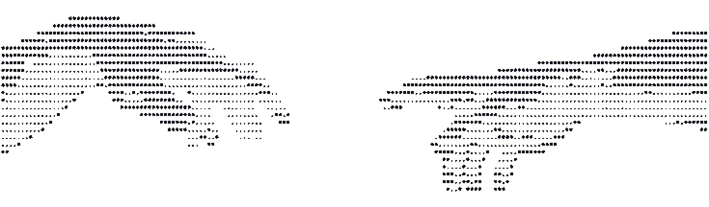
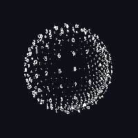

<!-- GENERADO POR scripts/build_readme.py — no editar a mano.
     El contenido sale de data/profile.json y de la API de GitHub.
     Para cambiar el diseño: templates/terminal.md -->

<div align="center">

<picture>
  <source media="(prefers-color-scheme: dark)" srcset="assets/terminal/banner.png">
  
</picture>

<picture>
  <source media="(prefers-color-scheme: dark)" srcset="assets/terminal/name.png">
  
</picture>


</div>

```
$ whoami

> desarrollador full-stack · Colombia
> en práctica profesional construyendo software de inventario

$ cat ./ahora.txt

> práctica profesional + proyectos propios
> metido en: testing, docker y microservicios
```

```
$ tree ./stack

  lenguajes ·······  java   python   typescript   javascript   c#
  frontend ········  react   next   react-native   vite   html   css
  backend ·········  django   flask   node   express   nestjs   spring   .net
  datos ···········  postgresql   mysql   mongodb   sqlite   firebase   supabase
  infra ···········  docker   github-actions   vercel   render   apache   git
  pruebas ·········  tdd   testing-library   mockito
  otros ···········  graphql   jwt   latex   arduino   powershell   notion
```

<div align="center">
  
</div>

```
$ ls ./proyectos --sort=recent
```

<table width="100%">
<tr valign="top">
  <td width="6%"><code>01</code></td>
  <td width="40%">
    <b>Sistema Inventario ICM</b><br>
    <sub><i>sin descripción</i></sub>
  </td>
  <td width="30%"><sub><code>Python · TypeScript · CSS · JavaScript</code></sub></td>
  <td width="24%" align="right"><sub>
    <a href="https://github.com/JuanJo0775/Sistema_Inventario_ICM_B">backend</a> ·
    <a href="https://github.com/JuanJo0775/Sistema_Inventario_ICM_F">frontend</a> ·
    <a href="https://sistema-inventario-icm-f.vercel.app">demo</a>
    </sub></td>
</tr>
<tr valign="top">
  <td><code>02</code></td>
  <td>
    <b>Ascii generator</b><br>
    <sub><i>sin descripción</i></sub>
  </td>
  <td><sub><code>JavaScript · Python · CSS</code></sub></td>
  <td align="right"><sub>
    <a href="https://github.com/JuanJo0775/Ascii_generator">repo</a>
    </sub></td>
</tr>
<tr valign="top">
  <td><code>03</code></td>
  <td>
    <b>FlashNotes</b><br>
    <sub><i>sin descripción</i></sub>
  </td>
  <td><sub><code>JavaScript · TypeScript · CSS</code></sub></td>
  <td align="right"><sub>
    <a href="https://github.com/JuanJo0775/flashnotes-backend">backend</a> ·
    <a href="https://github.com/JuanJo0775/flashnotes-frontend">frontend</a>
    </sub></td>
</tr>
<tr valign="top">
  <td><code>04</code></td>
  <td>
    <b>MeloSport</b><br>
    <sub><i>sin descripción</i></sub>
  </td>
  <td><sub><code>HTML · Python · JavaScript</code></sub></td>
  <td align="right"><sub>
    <a href="https://github.com/JuanJo0775/MeloSport">repo</a>
    </sub></td>
</tr>
<tr valign="top">
  <td><code>05</code></td>
  <td>
    <b>Sistema rutas del campus</b><br>
    <sub><i>sin descripción</i></sub>
  </td>
  <td><sub><code>JavaScript · Java · HTML</code></sub></td>
  <td align="right"><sub>
    <a href="https://github.com/JuanJo0775/Sistema-rutas-del-campus">repo</a>
    </sub></td>
</tr>
</table>

<br>

```
$ git log --stat --all
```

<div align="center">

<picture>
  <source media="(prefers-color-scheme: dark)" srcset="https://github-readme-stats.shion.dev/api?username=JuanJo0775&show_icons=true&include_all_commits=true&count_private=true&rank_icon=github&hide_title=true&bg_color=0D1117&text_color=A0A0A0&icon_color=FFFFFF&border_color=2A2A2A&title_color=FFFFFF">
  
</picture>
<picture>
  <source media="(prefers-color-scheme: dark)" srcset="https://streak-stats.demolab.com?user=JuanJo0775&background=0D1117&border=2A2A2A&stroke=2A2A2A&ring=FFFFFF&fire=FFFFFF&currStreakNum=FFFFFF&sideNums=A0A0A0&currStreakLabel=FFFFFF&sideLabels=A0A0A0&dates=6E6E6E">
  
</picture>

<br><br>

<picture>
  <source media="(prefers-color-scheme: dark)" srcset="https://github-readme-stats.shion.dev/api/top-langs/?username=JuanJo0775&layout=compact&langs_count=8&include_all_commits=true&count_private=true&hide_title=true&bg_color=0D1117&text_color=A0A0A0&border_color=2A2A2A&title_color=FFFFFF">
  
</picture>

</div>

<br>

<div align="center">

<picture>
  <source media="(prefers-color-scheme: dark)" srcset="assets/terminal/plate-a.png">
  
</picture>

</div>

```
$ cat ./contacto
```

<div align="center">

[](mailto:juanjo0731a@gmail.com) [](https://instagram.com/juan_nar_) [](https://github.com/JuanJo0775)

<!-- Mastodon: el link que traía GPRM estaba roto (espacios en el handle).
     Si usas Mastodon, agrégalo en data/profile.json bajo "contact". -->
<!-- LinkedIn (recomendado si estás en práctica): mismo sitio. -->

<sub><code>readme generado automáticamente · última actualización 2026-08-31</code></sub>

</div>
